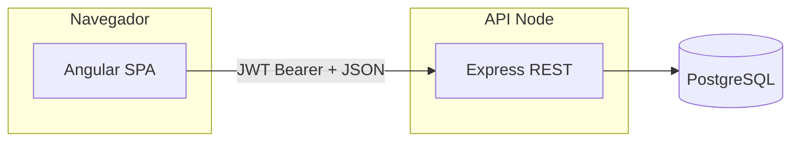
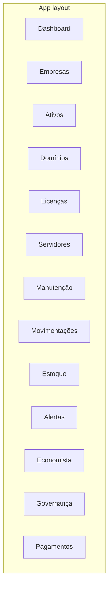

# Arquitetura — SIG Heartbeat Hub

Este documento descreve o **projeto atual do sistema** (maio de 2026): objetivos, componentes, dados, segurança e front-end. Deve ser atualizado quando mudarem integrações ou o modelo de dados.

## 1. Objetivos e contexto

- Centralizar a operação de TI em uma única aplicação web: inventário, contratos, DNS, riscos, orçamentos, alertas, etc.
- Suportar **várias organizações** (tenants lógicos via `org_id`) e **várias empresas** da holding por organização (`empresa_id`).
- Expor dados de forma segura através de uma **API REST** (Express + `pg`) que valida JWT e restringe operações ao `org_id` do perfil do utilizador.

## 2. Vista de contexto

A SPA **não** liga diretamente ao Postgres: usa `HttpClient` contra `backend/` (porta 3000 por defeito).

## 3. Stack tecnológica

| Camada | Tecnologia |
|--------|------------|
| SPA | Angular 21, componentes standalone, router com lazy loading |
| Estilos | Tailwind CSS 4 (`frontend/src/styles.css` importa `tailwindcss`) |
| Ícones | `lucide-angular` |
| Cliente HTTP | `@angular/common/http` + `ApiService` (`environment.apiUrl`) |
| API | Express 5, `pg`, JWT (`jsonwebtoken`), bcrypt (`bcryptjs`) no registo |
| Banco | PostgreSQL 16 — Docker `database/init/` (`01_schema`, `02_seed`, `03_api_auth`) |
| Monorepo scripts | `package.json` na raiz: `dev`, `build`, `db:*`, `api:dev` |

## 4. Front-end — organização

### Rotas (`frontend/src/app/app.routes.ts`)

- A raiz redireciona para `/dashboard`.
- O layout principal (`AppLayoutComponent`) agrupa as áreas da aplicação com shell comum.
- Rota pública **`/auth`** — login e cadastro (`AuthComponent`).

O arquivo `frontend/src/app/guards/auth.guard.ts` redireciona para `/auth` quando não há utilizador autenticado (após o bootstrap da sessão JWT).

### Serviços principais

| Serviço | Papel |
|---------|--------|
| `ApiService` | URL base, token em `localStorage`, pedidos HTTP (`/api/auth/*`, `/api/data/*`). |
| `AuthService` | Sessão, `signIn` / `signUp` / `signOut`, bootstrap com `/auth/me`. |
| `EmpresaService` | Lista `empresas`, empresa selecionada (persistida), seed opcional de nomes da holding. |
| `DashboardService` | Carrega dados via `GET /api/data/dashboard`, mapeia linhas SQL para modelos de UI. |
| `CrudService` | Insert/update/delete e bulk insert via API; injeta `org_id` e `empresa_id` conforme a seleção. |
| `ToastService` | Feedback de operações. |

### Componentes compartilhados

Em `frontend/src/app/components/` (exemplos): `data-toolbar`, modais, gráficos SVG, toasts — padrão de listagens com CSV e formulários.

## 5. Modelo de dados (lógico)

A referência do schema local está em **`database/init/01_schema.sql`**. Tabelas `public` principais:

- **Núcleo:** `organizations`, `empresas`, `departamentos`, `usuarios`, `profiles`, `user_roles`
- **Operação:** `ativos`, `dominios`, `dns_records`, `licencas`, `servidores`, `contratos`, `manutencoes`, `movimentacoes`
- **Inventário:** `inventario`, `inventario_movimentacoes`
- **Finanças / economia:** `pagamentos`, `orcamentos`, `acoes_economista`
- **Governança:** `registros_acesso`, `riscos`, `termos_responsabilidade`
- **Transversal:** `alertas`

Enums relevantes (exemplos): `ativo_status`, `alerta_severidade`, `app_role`, `pagamento_categoria`, `pagamento_status`.

A **fonte de verdade** para desenvolvimento local é `database/init/` (`01_schema.sql`, `02_seed.sql`, `03_api_auth.sql`). Alterações incrementais em SQL vivem em **`database/migrations/`** (aplicar com `npm run db:apply-migrations`).

## 6. Segurança e multi-tenant

- **Autenticação:** JWT emitido pela API (`POST /api/auth/login`); verificação de palavra-passe com `crypt()` no PostgreSQL (compatível com bcrypt) ou hash criado no registo com `bcryptjs`.
- **Perfil:** `profiles` liga `user_id` a `org_id`.
- **Isolamento:** a API filtra sempre por `org_id` obtido de `profiles` para `GET /api/data/dashboard`, `GET /api/data/empresas` e mutações em `public.*`. Não há RLS obrigatória no Postgres enquanto o único cliente da base for a API.
- **Empresa:** `CrudService` define `empresa_id` num conjunto fixo de tabelas ao criar/atualizar registros.

## 7. Configuração e ambientes

- **Angular:** `environment.ts` (URL da API por defeito `http://127.0.0.1:3000/api`). Em desenvolvimento local, na raiz `npm run dev`, `npm run dev:ui` ou `npm run dev:stack` usam `environment.local.ts` (credenciais demo no login); em `frontend/`, `npm run dev:local` faz o mesmo.
- **Produção:** `fileReplacements` no `angular.json` ou variáveis de CI para `environment.prod.ts` (criar se necessário).

## 8. Operação local da base

- **Postgres Docker:** `npm run db:up` | `db:down` | `db:reset` na raiz; porta no host **5433** (`HOST_PG_PORT`); ver `scripts/db.sh`.
- **API + UI:** `npm run dev:stack` na raiz (com Postgres já a correr); ou `npm run api:dev` e `npm run dev:ui` em separado.
- **Verificação:** `npm run check:stack` (Postgres + `/health`).
- **API:** `npm run api:dev` na raiz (ou `cd backend && npm run dev`).
- **Na aplicação:** com sessão, rota **`/dados-banco`** (menu **Dados & base**) — ligações, health da API e contagens por tabela da organização.
- Importação pontual de um servidor Postgres remoto para o contentor da 5433: `npm run db:sync-remote` e `.env` (opcional).
- Guia único no repositório: [dados-e-banco.md](./dados-e-banco.md).

## 9. Relação com outros documentos

- **[dados-e-banco.md](./dados-e-banco.md)** — guia operacional (Docker, API, import CSV, migrações).
- **Este arquivo** — visão de arquitetura estável; atualizar em PRs que alterem auth, API ou rotas principais.

## 10. Diagrama de módulos de UI (rotas)

---

*Última revisão alinhada ao código no commit em que este arquivo foi criado ou alterado.*
