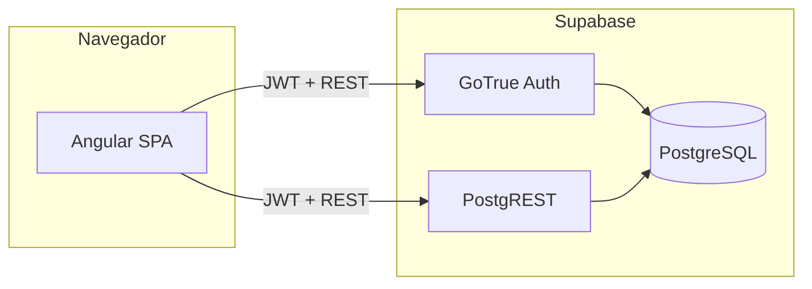
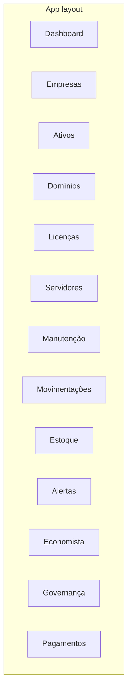

# Arquitetura — SIG Heartbeat Hub

Este documento descreve o **projeto atual do sistema** (maio de 2026): objetivos, componentes, dados, segurança e front-end. Deve ser atualizado quando mudarem integrações ou o modelo de dados.

## 1. Objetivos e contexto

- Centralizar a operação de TI em uma única aplicação web: inventário, contratos, DNS, riscos, orçamentos, alertas, etc.
- Suportar **várias organizações** (tenants lógicos via `org_id`) e **várias empresas** da holding por organização (`empresa_id`).
- Expor dados de forma segura no **Supabase**, com políticas RLS alinhadas ao `org_id` do usuário autenticado.

## 2. Vista de contexto

O **backend Node** em `backend/` é um servidor Express mínimo com TypeORM; **não** é hoje o canal principal de leitura/escrita de dados — a SPA fala **diretamente** com o Supabase.

## 3. Stack tecnológica

| Camada | Tecnologia |
|--------|------------|
| SPA | Angular 21, componentes standalone, router com lazy loading |
| Estilos | Tailwind CSS 4 (`frontend/src/styles.css` importa `tailwindcss`) |
| Ícones | `lucide-angular` |
| Cliente dados | `@supabase/supabase-js` com tipagem em `frontend/src/app/services/database.types.ts` |
| Banco cloud | PostgreSQL gerenciado pelo Supabase + migrações em `supabase/migrations/` |
| Banco local | Postgres 16 em Docker/Podman, schema em `database/init/01_schema.sql` |
| Monorepo scripts | `package.json` na raiz: `dev`, `build`, `db:*` |

Nota: existe também `src/integrations/supabase/` (cliente Vite + `import.meta.env`) — artefato paralelo; a aplicação principal é **`frontend/`**.

## 4. Front-end — organização

### Rotas (`frontend/src/app/app.routes.ts`)

- A raiz redireciona para `/dashboard`.
- O layout principal (`AppLayoutComponent`) agrupa as áreas da aplicação com shell comum.
- Rota pública **`/auth`** — login e cadastro (`AuthComponent`).

O arquivo `frontend/src/app/guards/auth.guard.ts` redireciona para `/auth` quando não há sessão, mas **as rotas do layout não aplicam esse guard por padrão**; a proteção efetiva depende do Supabase (RLS) e, no futuro, de `canActivate` onde fizer sentido.

### Serviços principais

| Serviço | Papel |
|---------|--------|
| `SupabaseService` | Instância única do `SupabaseClient` (URL/chave em `environment.ts`). |
| `AuthService` | Sessão, `signIn` / `signUp` / `signOut`, `onAuthStateChange`. |
| `EmpresaService` | Lista `empresas`, empresa selecionada (persistida), seed opcional de nomes da holding. |
| `DashboardService` | Carrega agregações e listas, mapeia linhas SQL para modelos de UI; `BehaviorSubject`s para reactividade. |
| `CrudService` | Insert/update/delete e bulk insert; injeta `org_id` e, para tabelas listadas, `empresa_id` conforme a seleção. |
| `ToastService` | Feedback de operações. |

### Componentes compartilhados

Em `frontend/src/app/components/` (exemplos): `data-toolbar`, modais, gráficos SVG, toasts — padrão de listagens com CSV e formulários alinhado ao roadmap em `.lovable/plan.md`.

## 5. Modelo de dados (lógico)

A referência do schema local está em **`database/init/01_schema.sql`**. Tabelas `public` principais:

- **Núcleo:** `organizations`, `empresas`, `departamentos`, `usuarios`, `profiles`, `user_roles`
- **Operação:** `ativos`, `dominios`, `dns_records`, `licencas`, `servidores`, `contratos`, `manutencoes`, `movimentacoes`
- **Inventário:** `inventario`, `inventario_movimentacoes`
- **Finanças / economia:** `pagamentos`, `orcamentos`, `acoes_economista`
- **Governança:** `registros_acesso`, `riscos`, `termos_responsabilidade`
- **Transversal:** `alertas`

Enums relevantes (exemplos): `ativo_status`, `alerta_severidade`, `app_role`, `pagamento_categoria`, `pagamento_status`.

As migrações em **`supabase/migrations/`** aplicam alterações ao projeto Supabase (ex.: políticas RLS em `empresas`, coluna `empresa_id` em módulos). O arquivo local `01_schema.sql` deve permanecer coerente com o modelo usado pela app.

## 6. Segurança e multi-tenant

- **Autenticação:** Supabase Auth; usuários em `auth.users` (no Postgres local há stub de `auth.users` para FKs).
- **Perfil:** `profiles` liga `user_id` a `org_id` (e metadados de apresentação).
- **RLS (Supabase):** políticas típicas comparam `org_id` da linha com **`current_org_id()`** (função no servidor). No Postgres local do contêiner, a função pode ser stub (`NULL`) — nesse caso o isolamento não reproduz o Supabase; o foco é desenvolvimento de schema e queries.
- **Empresa:** `CrudService` define `empresa_id` em um conjunto fixo de tabelas ao criar/atualizar registros, alinhado às colunas das migrações.

## 7. Configuração e ambientes

- **Supabase (Angular):** `frontend/src/environments/environment.ts` — substituir `placeholder` pela URL do projeto e pela **anon key** (nunca commitar secrets de serviço).
- **Produção:** usar `fileReplacements` no `angular.json` ou variáveis de CI para injetar `environment.prod.ts` (criar se necessário).

## 8. Operação local da base

- Scripts: `npm run db:up` | `db:down` | `db:reset` na raiz.
- Porta no host padrão **5433** (`HOST_PG_PORT`); ver `scripts/db.sh`.

## 9. Relação com outros documentos

- **`.lovable/plan.md`** — plano de funcionalidades e ordem de entrega no front; não substitui modelo de segurança nem diagrama de implantação.
- **Este arquivo** — visão de arquitetura estável; atualizar em PRs que alterem auth, RLS ou rotas principais.

## 10. Diagrama de módulos de UI (rotas)

---

*Última revisão alinhada ao código no commit em que este arquivo foi criado ou alterado.*
