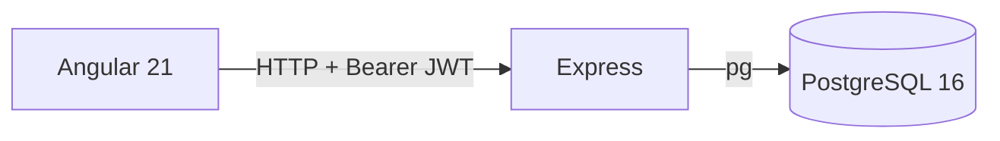

# Arquitetura — SIG Gestão TI

Arquitetura do sistema em uso interno: SPA Angular, API Express com JWT, PostgreSQL 16.

## Visão

Consola de gestão de TI da IMTS. Isolamento em dois níveis:

- **`org_id`** — organização (tenant).
- **`empresa_id`** — empresa dentro da organização.

## Diagrama



A SPA **não** acede ao Postgres. Toda a lógica de auth, papéis e filtro por organização está na API.

## Stack

| Camada | Detalhe |
|--------|---------|
| SPA | Angular 21 (standalone, lazy routes), Tailwind 4, lucide / Font Awesome, PrimeNG |
| HTTP | `HttpClient` → `ApiService` |
| API | Express 5, `pg`, compression, CORS |
| Auth | JWT (`jsonwebtoken`) + password hash (`pgcrypto` / bcrypt) |
| BD | PostgreSQL 16 |

## Autenticação

1. `POST /api/auth/login` — email + password.
2. Validação em `auth.users` (hash `crypt` / `pgcrypto`).
3. JWT assinado com `JWT_SECRET`.
4. Cliente envia `Authorization: Bearer <token>`.
5. `requireAuth` valida o token; `profiles` + `user_roles` resolvem `org_id` e papel.

Outros endpoints (`backend/src/routes/auth.ts`): signup, `/me`, change-password, CRUD de utilizadores (admin).

## RBAC

| Papel | Escrita de dados | Gestão de users |
|-------|------------------|-----------------|
| `admin` | sim | sim |
| `gestor` | sim | não |
| `usuario` | não | não |

Código: `backend/src/profile.ts`, `middleware/rbac.ts`; frontend: `PermissionService`. Não é permitido remover o último admin da org. Signup cria o primeiro user como `admin` da nova org.

## Multi-tenant (`DATA_SCOPE`)

| Valor | Comportamento |
|-------|----------------|
| `org` (predefinição) | Leituras e escritas limitadas ao `org_id` do perfil |
| `all` | Escape hatch de desenvolvimento — **proibido** em ambiente interno partilhado |

Inserts forçam o `org_id` do token (mitiga BOLA). Implementação: `backend/src/org-scope.ts`.

## API

### Health (sem JWT)

- `GET /health`, `GET /api/health`
- `GET /api/health/db`

### Auth — `/api/auth`

Login, signup, me, change-password, logout (noop no cliente), users (admin).

### Dados — `/api/data` (JWT)

| Método | Caminho | Notas |
|--------|---------|-------|
| GET | `/status` | Contagens, papel, escopo |
| GET | `/dashboard?tables=` | Leitura em bloco |
| GET | `/empresas` | Empresas da org |
| POST | `/:table` | Insert (requer escrita) |
| PATCH | `/:table/:id` | Update |
| DELETE | `/:table/:id` | Delete |

Tabelas expostas: `backend/src/tables.ts` (`ativos`, `dominios`, `licencas`, `servidores`, `contratos`, `manutencoes`, `pagamentos`, `orcamentos`, `riscos`, …). Algumas tabelas sensíveis (`profiles`, `user_roles`, `organizations`) estão bloqueadas no CRUD genérico.

## Modelo de dados

Schema: `database/init/01_schema.sql`.

- **Auth:** `auth.users`
- **Núcleo:** `organizations`, `empresas`, `departamentos`, `profiles`, `user_roles`
- **Operação:** `ativos`, `dominios`, `dns_records`, `licencas`, `servidores`, `contratos`, `manutencoes`, `movimentacoes`, `inventario`, `alertas`
- **Finanças / risco:** `pagamentos`, `orcamentos`, `acoes_economista`, `riscos`, `registros_acesso`, `termos_responsabilidade`

Migrações: `database/migrations/` → log em `public._repo_migration_log`.

## Frontend

Rotas: `frontend/src/app/app.routes.ts`. Layout com sidebar (`app-shell-sidebar`).

Ferramentas partilhadas:

- `data-toolbar` — pesquisa, filtros, CSV, calendário
- `utils/ics.util.ts` — geração iCalendar (VEVENT all-day)
- `utils/csv.util.ts` — import/export CSV
- `UxFeedbackService` — toasts de validação / sucesso

## Desenvolvimento

```bash
npm run db:up
npm run dev
```

API `:3000`, app `:8080`, demo `dev@local.imts` / `demo123456`.

Ver [dados-e-banco.md](./dados-e-banco.md) e [uso-interno.md](./uso-interno.md).
